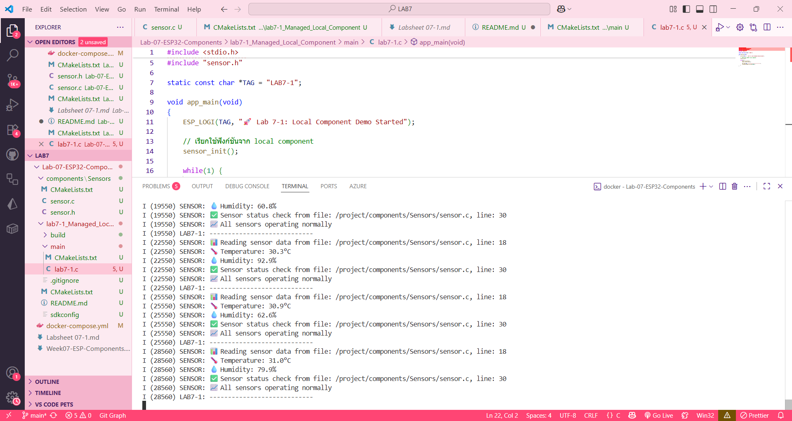
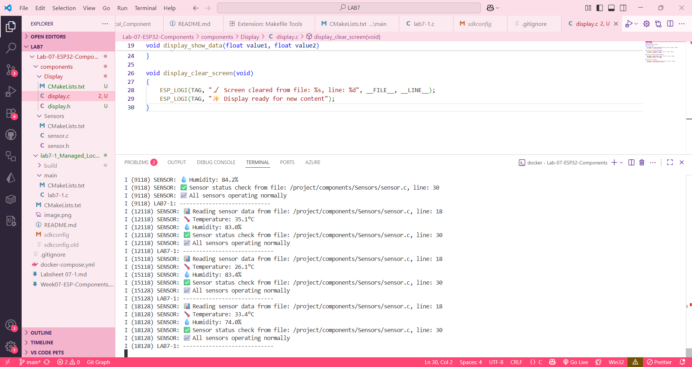

# Lab 7-1: Local Component Demo

## คำอธิบาย
การทดลองนี้แสดงการใช้งาน component ที่มีอยู่ในโฟลเดอร์ `components/Sensors/` ของ project

## สรุปคำสั่งที่ใช้ และผลลัพธ์ที่ได้
ใช้คำสั่ง idf.py set-target esp32 จากนั้นตามด้วย idf.py build และ idf.py qemu เพื่อดูผล

ผลลัพธ์จะแสดงประมาณนี้ 
I (19540) LAB7-1: 🚀 Lab 7-1: Local Component Demo Started
I (19540) SENSOR: 🔧 Sensor initialized from file: /project/components/Sensors/sensor.c, line: 12
I (19540) SENSOR: 📡 Sensor module ready for operation
I (19540) SENSOR: 📊 Reading sensor data from file: /project/components/Sensors/sensor.c, line: 18
I (19540) SENSOR: 🌡️  Temperature: 30.1°C
I (19550) SENSOR: 💧 Humidity: 60.8%
I (19550) SENSOR: ✅ Sensor status check from file: /project/components/Sensors/sensor.c, line: 30
I (19550) SENSOR: 📈 All sensors operating normally
I (19550) LAB7-1: ----------------------------
I (22550) SENSOR: 📊 Reading sensor data from file: /project/components/Sensors/sensor.c, line: 18
I (22550) SENSOR: 🌡️  Temperature: 30.3°C
I (22550) SENSOR: 💧 Humidity: 92.9%
I (22550) SENSOR: ✅ Sensor status check from file: /project/components/Sensors/sensor.c, line: 30
I (22550) SENSOR: 📈 All sensors operating normally
I (22550) LAB7-1: ----------------------------

__โจทย์ท้าทาย__
หลังจากนำโค้ดจาก main.c ในใบงานที่ 6 มาใช้เพิ่ม Display แล้ว build พร้อมทดสอบ แล้วได้ผลลัพธ์ดังนี้
