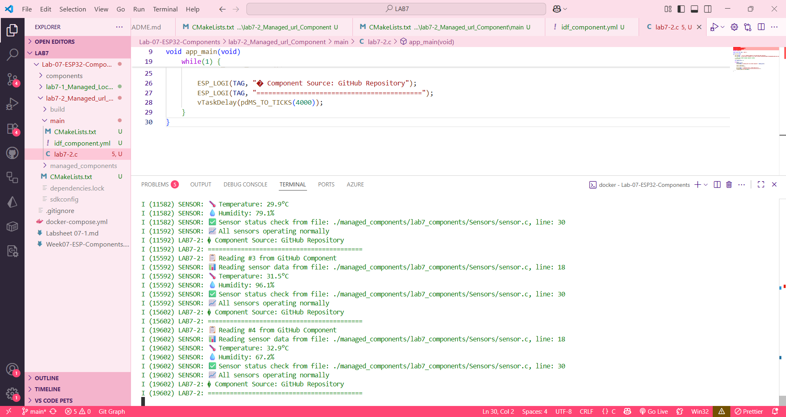

# Lab 7-2: Managed Component from GitHub URL Demo

## คำอธิบาย
การทดลองนี้แสดงการใช้งาน managed component จาก GitHub Repository
ใช้ `Sensors` component จาก https://github.com/APPLICATIONS-OF-MICROCONTROLLERS/Lab7_Components

## ผลลัพธ์ที่คาดหวัง
- แสดงข้อความการเริ่มต้น sensor จาก GitHub component
- แสดงข้อมูล temperature และ humidity ทุก 4 วินาที
- แสดงสถานะการทำงานของ sensor
- แสดงแหล่งที่มาของ component (GitHub Repository)

## ความแตกต่างจาก Lab 7-1
- Lab 7-1: ใช้ local component (ในเครื่อง)
- Lab 7-2: ใช้ managed component จาก GitHub URL

## การใช้งาน
1. เข้าไปในโฟลเดอร์ lab7-2_Managed_url_Component
2. รันคำสั่ง `idf.py build` (จะดาวน์โหลด component จาก GitHub อัตโนมัติ)
3. ทดสอบด้วย QEMU

ผลลัพธ์ที่แสดงจะประมาณนี้
I (11582) LAB7-2: 📋 Reading #2 from GitHub Component
I (11582) SENSOR: 📊 Reading sensor data from file: ./managed_components/lab7_components/Sensors/sensor.c, line: 18
I (11582) SENSOR: 🌡️  Temperature: 29.9°C
I (11582) SENSOR: 💧 Humidity: 79.1%
I (11582) SENSOR: ✅ Sensor status check from file: ./managed_components/lab7_components/Sensors/sensor.c, line: 30
I (11592) SENSOR: 📈 All sensors operating normally
I (11592) LAB7-2: � Component Source: GitHub Repository
I (11592) LAB7-2: ==========================================
I (15592) LAB7-2: 📋 Reading #3 from GitHub Component
I (15592) SENSOR: 📊 Reading sensor data from file: ./managed_components/lab7_components/Sensors/sensor.c, line: 18
I (15592) SENSOR: 🌡️  Temperature: 31.5°C
I (15592) SENSOR: 💧 Humidity: 96.1%
I (15592) SENSOR: ✅ Sensor status check from file: ./managed_components/lab7_components/Sensors/sensor.c, line: 30
I (15592) SENSOR: 📈 All sensors operating normally
I (15602) LAB7-2: � Component Source: GitHub Repository
I (15602) LAB7-2: ==========================================
I (19602) LAB7-2: 📋 Reading #4 from GitHub Component
I (19602) SENSOR: 📊 Reading sensor data from file: ./managed_components/lab7_components/Sensors/sensor.c, line: 18
I (19602) SENSOR: 🌡️  Temperature: 32.9°C
I (19602) SENSOR: 💧 Humidity: 67.2%
I (19602) SENSOR: ✅ Sensor status check from file: ./managed_components/lab7_components/Sensors/sensor.c, line: 30
I (19602) SENSOR: 📈 All sensors operating normally
I (19602) LAB7-2: � Component Source: GitHub Repository
I (19602) LAB7-2: ==========================================
I (23602) LAB7-2: 📋 Reading #5 from GitHub Component
I (23602) SENSOR: 📊 Reading sensor data from file: ./managed_components/lab7_components/Sensors/sensor.c, line: 18
I (23602) SENSOR: 🌡️  Temperature: 29.2°C
I (23602) SENSOR: 💧 Humidity: 78.2%
I (23602) SENSOR: ✅ Sensor status check from file: ./managed_components/lab7_components/Sensors/sensor.c, line: 30
I (23602) SENSOR: 📈 All sensors operating normally
I (23602) LAB7-2: � Component Source: GitHub Repository
I (23602) LAB7-2: ==========================================
I (27602) LAB7-2: 📋 Reading #6 from GitHub Component
I (27602) SENSOR: 📊 Reading sensor data from file: ./managed_components/lab7_components/Sensors/sensor.c, line: 18
I (27602) SENSOR: 🌡️  Temperature: 34.2°C
I (27602) SENSOR: 💧 Humidity: 62.6%
I (27602) SENSOR: ✅ Sensor status check from file: ./managed_components/lab7_components/Sensors/sensor.c, line: 30
I (27602) SENSOR: 📈 All sensors operating normally
I (27602) LAB7-2: � Component Source: GitHub Repository
I (27602) LAB7-2: ==========================================

หลังจากนำโค้ดจาก main.c ในใบงานที่ 6 มาใช้ แล้ว build พร้อมทดสอบ ให้ผลลักษณะเดียวกับ component แบบ local แต่ต่างที่ส่วนตรง Component Source: GitHub Repository