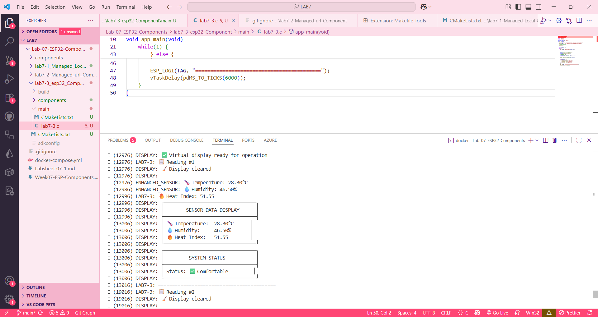

# Lab 7-3: Custom ESP32 Components (Sensor + Display)

## คำอธิบาย
การทดลองนี้แสดงการสร้าง component ใหม่ด้วยคำสั่ง `idf.py create-component`
สร้าง 2 components:
1. **Sensor Component** - อ่านค่า temperature, humidity และคำนวณ heat index
2. **Display Component** - แสดงผลข้อมูลในรูปแบบตาราง

ผลลัพธ์ที่ได้ดังนี้
